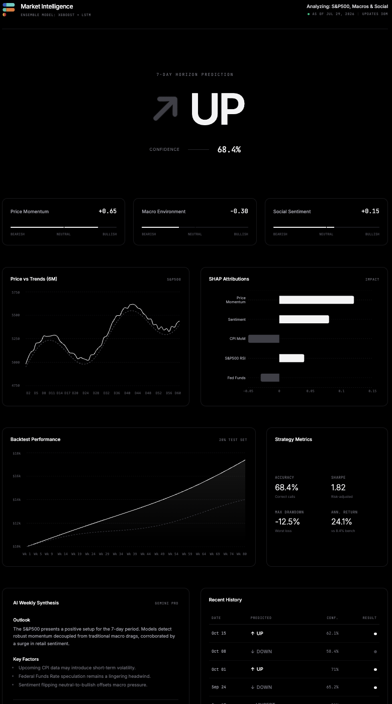

# Automated Market Intelligence Analyst

An end-to-end quantitative research system that forecasts the 7-day directional move of the S&P 500 by fusing price action, macroeconomic releases, and social sentiment into an explainable ensemble[...]

App Website: https://market-intelligence-frontend.onrender.com

Repository: https://github.com/thedeepakreddy/Automated-Market-Intelligence-Analyst

---



## Overview

Most retail-facing market models stop at a prediction. A research desk needs three things a prediction alone cannot provide: a defensible data lineage, a validation scheme that respects time, and an e[...]

This project is built around those three requirements. It ingests four asset series and five macro indicators, engineers a momentum and volatility feature set, trains a gradient-boosted tree and a[...]

The result is a working analogue of the workflow an analyst runs manually every week, compressed into a repeatable, auditable pipeline.

---

## System Architecture

```text
  Data Layer                Feature Layer            Model Layer              Delivery Layer
+--------------+        +-------------------+    +-----------------+    +--------------------+
| yfinance     |        | Momentum: SMA     |    | XGBoost         |    | Flask /api/latest  |
| ^GSPC ^IXIC  |        | 7 / 14 / 30       |    | (tabular signal)|    | SQLite run store   |
| GC=F  CL=F   | -----> |                   | -->|                 | -->| React dashboard    |
|              |        | Volatility, RSI   |    | LSTM 64 -> 32   |    | (Vite, Recharts)   |
| FRED macro   |        | Bollinger Bands   |    | (sequential)    |    |                    |
| CPI UNRATE   | -----> | Macro MoM deltas  | -->|                 | -->| Weekly PDF memo    |
| FEDFUNDS GDP |        | Sentiment moment. |    | Probability     |    | (Gemini +          |
| UMCSENT      |        | Lags 1/3/7/14     |    | ensemble        |    |  ReportLab)        |
|              |        |                   |    |        |        |    | Backtest vs        |
| Reddit (praw)| -----> | Target: 7d fwd    | -->|      SHAP       | -->| buy-and-hold       |
| + VADER      |        | direction, binary |    | attribution     |    | (APScheduler, 30m) |
+--------------+        +-------------------+    +-----------------+    +--------------------+
```

---

## Data Sources

| Source | Series | Purpose |
| --- | --- | --- |
| yfinance | `^GSPC`, `^IXIC`, `GC=F`, `CL=F` | Equity benchmark, tech beta, and the gold/oil cross-asset risk signal |
| FRED (`fredapi`) | CPIAUCSL, UNRATE, FEDFUNDS, A191RL1Q225SBEA, UMCSENT | Inflation, labour, policy rate, growth, and consumer confidence regime context |
| Reddit (`praw`) | Retail finance discussion | Crowd positioning and sentiment momentum |

Macro series publish at monthly or quarterly frequency, so they are resampled to a daily index and forward-filled. This deliberately avoids look-ahead: a value is only carried forward from its rel[...]

Reddit sentiment is scored with VADER over the newest posts in each configured subreddit, plus the top comments on the most recent threads, and aggregated to a daily mean. The Reddit API only exposes recent listings, so the observed window is days-to-weeks rather than the full two years the model trains over. Days with no observation are filled with a neutral `0.0` and carry a `Sentiment_Volume` of `0`, which keeps an imputed day distinguishable from a genuinely flat one. If Reddit credentials are absent or the API fails, the run falls back to an all-zero series and records that fact in `data_sources` rather than synthesising a signal.

---

## Feature Engineering

For each of the four instruments:

- **Trend**: 7, 14, and 30-day simple moving averages
- **Return and risk**: daily returns and 7-day rolling realised volatility
- **Mean reversion**: 14-period RSI and 20-period Bollinger Bands at two standard deviations
- **Memory**: S&P 500 close lagged 1, 3, 7, and 14 sessions

For each macro series:

- Level plus 30-day month-over-month percentage change, so the model reads the *direction of the surprise* rather than only the absolute level

**Target definition**: a binary label, one if the S&P 500 close seven sessions forward exceeds today's close, zero otherwise. Framing the problem as directional classification rather than point-es[...]

---

## Modelling Approach

Two learners with complementary inductive biases:

- **XGBoost** captures non-linear interactions across the wide cross-sectional feature panel, which is where macro-versus-momentum conflicts show up.
- **LSTM** (64 units returning sequences into 32 units, sigmoid output, Adam, binary cross-entropy) captures temporal structure the tree model discards.

The two probabilities are averaged, and the blend is mapped to a three-state signal rather than a forced binary:

| Ensemble probability | Signal |
| --- | --- |
| Above 0.55 | UP |
| 0.45 to 0.55 | UNCERTAIN |
| Below 0.45 | DOWN |

The neutral band is the point of the design. A model forced to be long or short every week generates turnover with no edge; declining to take a view when the signal sits inside the noise band is a[...]

---

## Validation Methodology

Financial time series break the assumptions behind standard cross-validation, so the pipeline enforces:

- **Chronological 80/20 split.** The test set is strictly the most recent window. No shuffling.
- **`TimeSeriesSplit` with 5 folds** over the training window, so every fold trains only on data preceding its validation slice. The per-fold and mean accuracies are scored before the model is refit on the full window, and both are reported in the API payload and the PDF.
- **Sessions, not calendar days.** Macro and sentiment values are forward-filled into trading sessions, but calendar days without a session never become rows, so the seven-day horizon is seven sessions.
- **No backward filling** of macro data across the release boundary.

These constraints lower headline accuracy relative to a randomly shuffled split. That is the intended trade-off: the number is lower because it is honest.

---

## Explainability

SHAP `TreeExplainer` runs against the gradient-boosted model to produce per-prediction feature attribution, surfaced in the dashboard as a ranked contribution chart.

This is the component that turns a score into research. It answers the question a portfolio manager asks first: is this call being driven by price momentum, by a shift in the rates and inflation [...]

---

## Evaluation Framework

`run_backtest` scores the signal on the held-out test window as a long/flat strategy — long when the call is UP, flat on DOWN or UNCERTAIN, never short — against buy-and-hold over the same period. Both streams report:

- Directional accuracy, over the periods where a directional call was actually made, alongside the coverage that accuracy is drawn from
- Sharpe ratio, that is risk-adjusted return rather than raw return
- Maximum drawdown
- Cumulative and annualised return versus benchmark

Reporting return without drawdown and Sharpe alongside it is the most common way a backtest flatters itself, so all four move together throughout the interface.

Two details matter for the numbers to mean anything. **Holding periods do not overlap**: positions are sampled every seven sessions, because compounding a seven-session forward return once per session would count each move roughly seven times and inflate the equity curve accordingly. And **UNCERTAIN is flat, not a coin flip**, so declining to take a view costs nothing but earns nothing — which is what makes the neutral band visible in the equity curve instead of hidden in the accuracy number. Transaction costs are supported via `cost_bps` and default to zero.

---

## Research Dashboard

A dark-themed React interface built for scanning, in the layout convention of a terminal research page:

- **Directional call** with confidence, above the fold
- **Signal gauges** for the underlying component scores
- **Price chart** with the model's regime overlay
- **SHAP attribution chart** for the current prediction
- **Equity curve** comparing the strategy against buy-and-hold
- **Strategy metrics** panel covering accuracy, Sharpe, max drawdown, and annualised return
- **Weekly generated outlook** in desk-memo format
- **Prediction history table** for tracking calls against outcomes

---

## Automation

- **APScheduler** re-runs the pipeline on a 30-minute interval inside the Flask process, so the dashboard reflects the current session rather than a stale batch job. The first run fires at startup rather than one interval later, and overlapping runs are coalesced so a slow retrain cannot pile up behind itself.
- **The scheduled job runs the whole chain**: fetch market, macro and social data, engineer features, cross-validate and train XGBoost, train the LSTM, predict, backtest, draft the report, persist the run.
- **Gemini** drafts the weekly outlook from the live prediction, confidence level, top SHAP drivers, and the realised backtest numbers, structured as current assessment, key risks, and supporting signals. Without a key, a deterministic summary of the run's own numbers stands in, labelled as such.
- **ReportLab** renders that outlook to a distributable PDF, with the signal and confidence, the backtest table, a bar chart and table of the top SHAP drivers, and the generated prose.
- **SQLite** persists every run — prediction, confidence, attribution, model scores, backtest, report text, and which data sources were actually used — so the API serves the latest completed run rather than recomputing on request.
- **Flask** exposes the health endpoint and the prediction endpoint below.

Each stage that depends on a credential degrades explicitly. A missing FRED key drops macro features, a missing Reddit key falls back to neutral sentiment, a missing Gemini key falls back to the template memo — and in every case the persisted record names the source that was actually used, so a degraded run is never mistaken for a clean one.

---

## API

| Endpoint | Returns |
| --- | --- |
| `GET /` | Health check for uptime monitoring on the deployment target |
| `GET /api/latest` | The most recent completed run: `prediction`, `probability`, `confidence`, ranked `top_features` with their attribution source, `model` scores (cross-validated accuracy, per-fold accuracies, test accuracy), the full `backtest` block including its equity curve, `data_sources`, and the generated `report` text |

`GET /api/latest` answers `503` with `{"status": "pending"}` until the first scheduled run completes. Responses carry permissive CORS headers, since the dashboard is served from a different origin; set `CORS_ORIGIN` to narrow that.

---

## Tech Stack

| Layer | Technologies |
| --- | --- |
| Modelling | XGBoost, TensorFlow / Keras (LSTM), scikit-learn, SHAP |
| Data | pandas, NumPy, yfinance, fredapi, praw |
| Backend | Python 3.11, Flask, Gunicorn, APScheduler |
| Reporting | Google Gemini, ReportLab, Matplotlib |
| Frontend | React 19, TypeScript, Vite, Tailwind CSS v4, Recharts, Lucide |
| Deployment | Render Blueprint (`render.yaml`), pinned runtimes |

---

## Repository Structure

```text
.
├── src/                        React dashboard
│   ├── App.tsx                 Layout and composition
│   └── components/
│       ├── HeroSection.tsx     Directional call and confidence
│       ├── SignalGauges.tsx    Component signal scores
│       ├── PriceChart.tsx      Price series with model overlay
│       ├── ShapChart.tsx       Feature attribution
│       ├── BacktestChart.tsx   Strategy versus buy-and-hold
│       ├── MetricsTable.tsx    Accuracy, Sharpe, drawdown, return
│       ├── WeeklyReport.tsx    Generated market outlook
│       └── HistoryTable.tsx    Prediction log
├── python-backend/
│   ├── engine.py               Pipeline, features, ensemble, SHAP, backtest, report, API, scheduler
│   ├── conftest.py             Test bootstrap: scheduler off, temp database
│   ├── tests/
│   │   └── test_engine.py      Features, ensemble, backtest, sentiment, API
│   ├── requirements.txt
│   └── requirements-dev.txt
├── render.yaml                 Blueprint for API and static frontend
├── python-version.txt          Pinned runtime, 3.11.9
├── vite.config.ts
└── package.json
```

---

## Running Locally

### Prerequisites

Python 3.11, Node 20, and API keys for FRED, Reddit, and Google Gemini. All three have free tiers. The engine starts and runs without them, in the degraded-but-labelled mode described under Automation.

### Backend

```bash
cd python-backend
python -m venv .venv && source .venv/bin/activate
pip install -r requirements.txt
python engine.py
```

Serves on `http://localhost:5000`, or `$PORT` if set. The pipeline runs once at startup, so `GET /api/latest` has something to return within a couple of minutes.

Credentials are read from the environment:

```bash
FRED_API_KEY=your_key
REDDIT_CLIENT_ID=your_id
REDDIT_CLIENT_SECRET=your_secret
REDDIT_USER_AGENT=market-intelligence-analyst/1.0
GEMINI_API_KEY=your_key
```

Optional settings, all with working defaults:

| Variable | Default | Purpose |
| --- | --- | --- |
| `PIPELINE_INTERVAL_MINUTES` | `30` | Refresh interval for the scheduled run |
| `DISABLE_SCHEDULER` | unset | Set to `1` to load the module without starting the scheduler |
| `MARKET_DB_PATH` | `python-backend/market_intelligence.db` | Prediction store. Point at a mounted volume to survive redeploys — container disk does not |
| `MARKET_REPORT_PATH` | `python-backend/weekly_report.pdf` | Where the weekly PDF is written |
| `REDDIT_SUBREDDITS` | `investing,stocks` | Comma-separated subreddits to score |
| `REDDIT_POST_LIMIT` | `200` | Posts pulled per subreddit per run |
| `REDDIT_COMMENT_POST_LIMIT` | `25` | How many of the newest threads get their comments expanded |
| `REDDIT_COMMENTS_PER_POST` | `5` | Top comments scored per expanded thread |
| `GEMINI_MODEL` | `gemini-2.5-flash` | Model used to draft the outlook |
| `CORS_ORIGIN` | `*` | Origin allowed to call the API |

Run the engine at one Gunicorn worker. Each worker would otherwise start its own scheduler and duplicate every run.

### Tests

```bash
cd python-backend
pip install -r requirements-dev.txt
pytest
```

All tests run on synthetic data — no network, no credentials — covering the feature panel's shape and columns, the ensemble's prediction format, the backtest arithmetic against hand-computed expectations, the Reddit sentiment aggregation against a stubbed client, and the `/api/latest` contract.

### Frontend

```bash
npm install
npm run dev
```

Serves on `http://localhost:3000`.

---

## Deployment

`render.yaml` defines both services as a single Render Blueprint:

- **`market-intelligence-api`** — Python web service on Gunicorn, with Python pinned to 3.11.9 for TensorFlow and Keras compatibility
- **`market-intelligence-frontend`** — static site built with Vite, Node pinned to 20.11.0

Connect the repository under Blueprints in Render and both services provision from the manifest, with continuous deployment on push to `main`.

---

## Project Status

The backend is wired end to end. The scheduled job runs the real chain — ingest, features, cross-validated training, prediction, backtest, report — and persists each run to SQLite for `GET /api/latest` to serve. Reddit sentiment is scored with VADER rather than simulated, `run_backtest` computes accuracy, Sharpe, drawdown and cumulative return against buy-and-hold, and the weekly PDF carries the generated outlook, the backtest table, and the SHAP drivers.

What remains:

- **Dashboard data binding** — the React components still render hardcoded constants. `GET /api/latest` now returns every field they need, including the backtest equity curve, but the fetch layer is not written, so **the numbers currently on the dashboard are interface placeholders, not model output**. Read them as such until the components are bound to the endpoint.
- **Prediction history** — runs accumulate in the `predictions` table, but no endpoint reads the series back, so the history table has nothing live to show yet. Note that container disk is ephemeral: without `MARKET_DB_PATH` on a mounted volume, history resets on redeploy.
- **Sentiment history depth** — the Reddit API only exposes recent listings, so sentiment is genuinely observed for days-to-weeks and neutral-filled before that. The feature is real but shallow, and its attribution should be read with that in mind.

On the model's edge: accuracy, Sharpe and drawdown are computed from the held-out window, benchmarked against buy-and-hold, and reported whatever they come out to. A weak or negative result is the expected outcome for a two-year sample of weekly direction, and nothing in the pipeline suppresses it.

### Roadmap

- Slippage assumptions on top of the existing `cost_bps` transaction-cost hook
- Walk-forward analysis with periodic retraining, in place of a single split
- Bind the dashboard to `/api/latest`, and add a history endpoint for live hit-rate tracking against realised outcomes
- Probability calibration, Platt or isotonic, so confidence is interpretable as a frequency
- Regime-conditional evaluation, reporting performance separately across volatility states

---

## What This Project Demonstrates

- **Quantitative research process**: hypothesis-driven feature construction, time-aware validation, and benchmark-relative evaluation
- **Financial domain knowledge**: cross-asset signal construction, macro regime context, technical indicator design, and the risk metrics that gate a strategy
- **Machine learning engineering**: ensemble design across complementary model classes, with explainability as a first-class requirement rather than an afterthought
- **Data engineering**: multi-source ingestion across mismatched frequencies, with explicit handling of release timing and look-ahead risk
- **Full-stack and deployment**: a Python service and TypeScript research interface, deployed through infrastructure-as-code with pinned runtimes
- **Research communication**: findings rendered as a dashboard and a written outlook memo, in the format a decision-maker actually consumes

---

## Disclaimer

This project is for educational and research purposes only. It is not investment advice, and nothing here is a recommendation to buy or sell any security. Model outputs are experimental and have not b[...]

---

## Author

**Deepak Reddy**

Working at the intersection of quantitative research, machine learning, and financial markets. Open to analyst and quantitative research roles.

GitHub: [@thedeepakreddy](https://github.com/thedeepakreddy)
